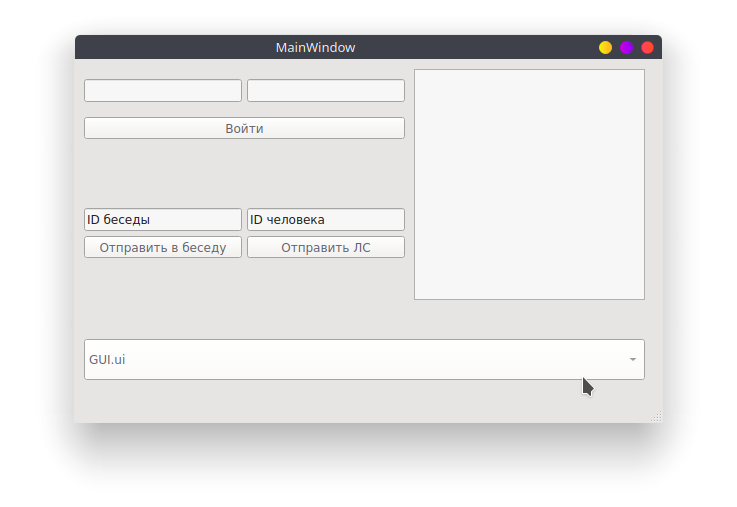

# VKGolos - отправка голосовых из mp3
    $ git clone https://github.com/LencoDigitexer/VKGolos.git
    $ cd VKGolos
    
В эту папку закидываем mp3 файлы (например, пак голосовых ).
> Запускаем:

    $ python3 VKGOLOS.py
    

  

Вводим логин и пароль - получаем токен

  

Выбираем музыку из списка (он генерируется перед запуском скрипта)

  

> Profit!

  

