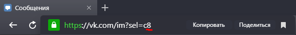

# VKGolos - отправка голосовых из mp3
    $ git clone https://github.com/LencoDigitexer/VKGolos.git
    $ cd VKGolos
    
В эту папку закидываем mp3 файлы (например, пак голосовых ).
> Запускаем:

    $ python3 VKGOLOS.py
    

  

Вводим логин и пароль - получаем токен

  

Выбираем музыку из списка (он генерируется перед запуском скрипта)

  

> Profit!

  

# Как узнать id беседы

Заходим в беседу

  

Смотрим на строку адреса в браузере (в Яндекс Браузере на нее нужно нажать, чтобы увидеть полный адрес)

  

Видим адрес 
>    vk.com/im?sel=c8
    
После <b>sel=c</b> идет число - это число является id беседы.
Вставляем в соответствующее поле программы

# Как узнать id пользователя
Инструкция точно такая же, как и для беседы.
Но адрес уже другой
>   vk.com/im?sel=510166866

  

После <b>sel=</b> идет число - это число является id человека вконтакте.
Вставляем в соответствующее поле программы
